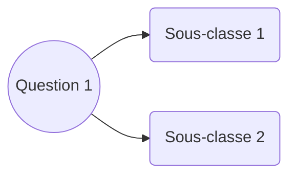

# DECISION ET APPRENTISSAGE

## Modèles linéaires pour la régression

On fait une prédiction linéaire en les données $x$ pour estimer un paramètre $t$ :

$$
y(\tilde x, \tilde w) = \tilde w^T\tilde X
$$

Les $w$ sont les paramètres de la machine, à déterminer.

Le symbole ~ indique que l'on rajoute un 1 dans chaque $x_n$, et que la dimension de $w$ est augmentée de 1 en conséquence (biais). Cela permet de gérer la moyenne quand on normalise les données. 

s

### Régression au sens des moindres carrés

On cherche à minimiser une fonction de coût quadratique : 

$$
\tilde w = \argmin_{\tilde w} \sum_{i=1}^N |t_i - y_i(x_i, \tilde w)|^2
= \argmin_{\tilde w} E_{LS}(\tilde w)
$$

On démontre qu'alors, $\tilde w$ vaut : 

$$
\tilde w = \underbrace{(\tilde X^T \tilde X)^{-1} \tilde X^T}_{\tilde X^{\text{\textdagger}}} t
$$

Au lieu de $X$, on peut éventuellement utiliser $\varphi(x)$ pour faire un changement de représentation. Alors :

$$
y = \tilde w \tilde \varphi(x) \text{ et } \tilde w = \tilde \Phi^{\text{\textdagger}}t
$$

### Régression linéaire régularisée

On contrôle les $w$ pour qu'il ne soient pas trop grands. 

- **On ne modifie pas $w_0$ !**

- **Il faut normaliser les données !**

On parle de **Ridge Regression** :

$$
w = \argmin_{w} \underbrace{\sum_{i=1}^N |t_i - w^T\varphi(x_i)|^2}_{\text{attache aux données}}
+ \underbrace {\lambda ||w||_2^2}_{\text{pénalité } l_2}
$$

Matriciellement :

$$
E_{RR}(w) = (t - \Phi w)^T(t - \Phi w) + \lambda w^T w
$$

Et la solution : 

$$
w = (\Phi^T\Phi + \lambda Id)^{-1}\Phi t
$$

### Approche bayésienne

On fait l'hypothèse que les observations sont indépendantes et identiquement distributées (iid).

On chercha alors à maximiser la vraisemblance (*likelihood*):

$$
\mathcal{L} = \prod_{n=1}^N \mathcal{N}(t_n | \tilde w^T \tilde x_n, \beta ^ {-1})
$$

où

$$
\begin{cases}
y_n = y_n(\tilde w, \tilde x_n) \\
\beta = \frac{1}{var(\text{bruit gaussien})}
\end{cases}
$$

Et dans ce cas, le $\tilde w $ qui maximise $\mathcal L$ est le même qu'au sens des moindres carrés.

*A priori*, $w$ suit une distribution aléatoire. Avec un *a priori* gaussien sur $w$, on retrouve le $w$ associé à la Ridge Regression. En général, tout *a priori* est une forme de régularisation.

L'intérêt d'avoir accès à une distribution de $w$ est qu'on peut donner la confiance qu'on a en la solution trouvée.

### Fonction de coût pour la régression

Le **risque réel** se définit comme l'espérance d'une fonction de coût. 

En théorie, la meilleure solution/prédiction théorique est :

$$
y(x) = \mathbb E [t|x]
$$

Choisir une fonction de coût, c'est choisir une solution et ses propriétés. Par exemple, les moindres carrés sont sensibles aux "queues lourdes" (*outsiders*), mais pas la médiane. En revanche, la médiane est sensible à la multimodalité.

### Compromis biais-variance

Plus le modèle est simple, plus le biais est grand, et plus la variance est faible. Il faut donc trouver un **compromis** entre les deux.

### Cas des dictionnaires : seuillage équivalent

Les changements de représentation peuvent être intéressants en termes de coût des algorithmes.

On supposexi que $t$ peut s'écrire dans une nouvelle base $\Phi$ : 

$$
t = \Phi w^*
$$

On cherche alors $y$ sous la forme :

$$
y = \Phi w
$$

Ce qui revient à minimiser : 

$$
w = \argmin_w ||t - \Phi w||^2 + \underbrace{\lambda G(w)}_{\text{pénalité}}
$$

Il existe différents types de pénalités, en particulier :

- Avec la norme $l_2$ (Ridge Regression), on a une **contraction **:

$$
\tilde w_j = \frac{w_j^*}{1 + \lambda}
$$

- Avec la norme $l_1$ (LASSO), on a un **seuillage doux** :

$$
\tilde w = 
\begin{cases}
0 & \text{si } |w_j^*| < \frac{\lambda}{2} \\
w_j^* -  \frac{\lambda}{2} sign(w^*) & \text{sinon}
\end{cases}
$$

- Avec la norme $l_0$ (parcimonie stricte), on a un **seuillage dur** :

$$
\tilde w_j = sign(w_j^*)\chi_{[\frac{\lambda}{2}; + \infty[}(|w_j^*|)
$$

La **parcimonie** correspond au fait d'annuler les petits coefficients.

## Classification et théorie de la décision

L'apprentissage est la construction d'une règle de classification $f$ (associant des attributs à des classes) à partir des données $\mathcal D$.

### Règle de Bayes pour la classification

La règle de classification qui minimise le risque réel est : 

$$
f^*(x) = \argmax_k \mathbb P (C_k | x)
$$

On définit aussi le **risque bayésien** $\mathbb E(f^*)$.

### Inférence et décision

L'**inférence** correspond à la détermination de $\mathbb P (C_k | x)$.

La **décision** correspond à l'utilisation de $\mathbb P (C_k | x)$ pour affecter des classes.

On distingue trois familles de modèles : 

- Les **fonctions discriminantes** permettent d'estimer $f(x)$ directement. Peu d'interprétation est possible, mais elles sont efficaces.
  
  *Exemple : les K plus proches voisins*

- Les **modèles discriminants** permettent d'estimer $\mathbb P (C_k | x)$. L'interprétation est plus facile, mais on est limité en termes de qualité.
  
  *Exemple : la régression logistique*

- Les **modèles génératifs** estiment $\mathbb P(x|C_k), \mathbb P(C_k)$. On peut donc générer les données soi-même. Cependant, on a posé une distribution paramétrique de $x$, qui est souvent inexacte.
  
  *Exemple : LDA*
  
  

### Choix du modèle

Il y a là encore un compromis biais-variance à trouver. Il faut également contrôler la richesse du modèle pour éviter le sur-apprentissage (*overfitting*).

#### Cas particulier des K plus proches voisins

Pour K grand, on ignore les phénomènes minoritaires (peu de variance mais biais important). A l'inverse, pour K petit, on considère les minorités comme importantes (peu de biais mais variance importante). 

Les K plus proches voisins sont limités avec l'augmentation de la dimension : on ne peut plus représenter la classification au delà de la 3D, le calcul de la distance peut devenir coûteux, et tous les points deviennent voisins en grande dimension.

#### Conclusions générales

Si le modèle est trop simple, on risque le sous-apprentissage.

Si le modèle est trop riche, on risque le sur-apprentissage.

... D'où la nécessité de trouver un compromis entre les deux.

## Modèles linéaires pour la classification supervisée

Être dans le cas linéaire signifie que les frontières de décision sont des hyperplans.

On dit que des données sont **linéairement séparables** lorsqu'un classifieur linéaire peut prédire exactement les classes sans erreur.

### Moindres carrés pour la classification

Les moindres carrés présentent plusieurs limites pour la classification : 

- ils sont sensibles aux évènements extrêmes

- il existe des situations où ils ne sont pas adaptés (problèmes de "masquage")

En somme, combiner modèle linéaire et coût quadratique ne fonctionne pas bien.

### Analyse discriminante linéaire / quadratique (LDA/QDA)

C'est un **modèle paramétrique gaussien** : 

$$
\forall k, \forall x \in C_k, \mathbb P(x|C_k) \sim \mathcal N(x|\mu_k, \Sigma_k)
$$

Dans le cas linéaire (LDA), $\Sigma_k = \Sigma$ indépendant de $k$. Sans cette hypothèse, on parle d'analyse discriminant quadratique (QDA).

La fonction de décision vaut toujours :

$$
f(x) = \argmax_k y_k(x) = \argmax_k \mathbb P(x, C_k)
$$

Un calcul de maximum de vraisemblance permet d'obtenir $\mu_k, \Sigma, $ et $\pi_k = \mathbb P(C_k)$ .

On en déduit la valeur de $y_k$ (*cf.* formule du cours) et donc la règle de décision.

Quelques remarques sur ces méthodes : 

- Les calculs de LDA et QDA sont plus ou moins équivalents en coût.

- En grande dimension, l'inversion de matrice devient coûteuse.

- En grande dimension, le modèle basé sur des gaussiennes n'est plus très bon.

- Le choix d'une méthode ou de l'autre est empirique.

- On utilise souvent les modèles linéaires en première approche pour savoir si les données sont linéairement séparables.

- On peut utiliser LDA pour faire de la réduction de dimension naïve :
  
  - Compression : si $x \in C_k$ on représente $x0$ par $\mu_k$.
  
  - Projection sur les axes $\mu_i, \mu_j$.

### Approche bayésienne naïve

On fait l'hypothèse (souvent fausse en pratique) que **les $x_i$ sont des variables indépendantes conditionnellement aux classes** :

$$
\forall k, \mathbb P(x | C_k) = \prod_{i=1}^D \mathbb P(x_i | C_k)
$$

On peut en déduire une formule pour $y_k(x)$ et donc une règle de décision.

Quelques remarques sur cette méthode : 

- Les $y_k$ obtenus sont linéaires en $x$, donc les frontières de décision sont des hyperplans.

- C'est une approximation grossière mais efficace en pratique (fort biais, faible variance). C'est dû à l'hypothèse forte d'indépendance.

- Cette méthode est utile en particulier en grande dimension.
  
  

### Régression logistique

C'est un **modèle discriminant** robuste aux *outliers*. 

#### Remarques préliminaires

On définit la fonction **sigmoïde** :

$$
\sigma(a) = \frac{1}{1+e^{-a}} = \frac{e^a}{1+e^{a}}
$$

Sa fonction inverse est appelée **logit** :

$$
logit(\sigma) = \ln \left( \frac{\sigma}{1 - \sigma} \right)
$$

Cette fonction a de bonnes propriétés pour la dérivée : 

$$
\sigma' = \sigma(1-\sigma)
$$

D'où le fait qu'on utilise cette fonction pour envoyer $\tilde w^T \tilde x \in \mathbb R$ dans $]0\text{;}1[$. La fonction tangeante hyperbolique était un autre candidat (plus utilisé par le passé).

#### Application à la classification

On cherche une activation qui dépend linéairement des attributs ($a = \tilde w^T \tilde x$).

Après calculs, on trouve que les $\tilde w$ permettant de maximiser la vraisemblance dans ces conditions vérifie : 

$$
\tilde X^T(\underbrace{\sigma(\tilde w^T \tilde x)}_{y} - t) = 0
$$

C'est un système non linéaire que l'on résout numériquement (*cf.* Newton-Raphson and *Iterated Reweighted Least Squares*).

L'interprétabilité mène beaucoup de gens à utiliser la régression logistique :

- on peut calculer l'augmentation d'un risque en fonction de l'évolution des paramètres

- on peut faire des calculs d'incertitude

On note que la frontière de décision reste linéaire, et que si les données sont linéairement séparables, $\tilde w$ diverge: on peut mettre en place une **régression logistique régularisée/pénalisée**.

## Evaluation des performances en reconnaissance des formes

On veut estimer une erreur de généralisation.

L'approche naïve est d'utiliser le taux d'erreur. Cependant, cet indicateur présente plusieurs défauts : 

- il faut beaucoup d'observations pour avoir un résultat significatif

- on limite la taille de l'échantillon en gardant des données pour le test

- l'erreur est généralement surestimée (biais pessimiste)

### Validation croisée

- On divise l'ensemble d'apprentissage en $v$ sous-ensembles.

- On apprend sur $v-1$ sous-ensembles et on test avec le dernier non-utilisé.

- On répète $v$ fois cette procédure en utilisant les $v$ ensembles comme base de test.

- L'erreur finale est la moyenne des $v$ taux d'erreur.

Cette méthode donne un taux d'erreur plus fiable et évite de "perdre" une partie de l'ensemble d'apprentissage. 

Idéalement, on garde une seule donnée pour le test, mais cela peut augmenter énormément le temps de calcul. Empiriquement, $v = 10$ est une bonne valeur.

### Matrices de confusion

$$
\begin{pmatrix}
\text{True positives TP)} & \text{False positives (FP)} \\
\text{False negatives (FN)} & \text{True negatives (TN)} \\
\end{pmatrix}
$$

Cette matrice permet de savoir où on s'est le plus trompé : c'est un indicateur plus détaillé que le taux d'erreur global.

### Courbe ROC (*Receiver Operating Characteristics*)

<img src="data:image/png;base64,iVBORw0KGgoAAAANSUhEUgAAAP4AAADHCAMAAAAOPR4GAAABIFBMVEX/////8sz/+NCamppqamozMzO6urpAQED/9s+LiYOUj4Dg1LK7vL//9M3/+tO7spba29wAAAAASMkARsmNin8ATMpzbVzr37z//9r57McAQsjCuJvKwKLd0rGDfGnz5sKclH1RTUFmYVLv7+/Uyamon4aQiHNKRjtZVEfPxKVCPzXp7/o4NS1TU1OkpKTExMSxwusAPcd7dWLg5/clJSXR2/Oluei/ze4xLieWj3gpJyF6enqPj48mJiZrZVWpqalVfNYOVs1qjNqKo+EoYc8zaNF5l97R0dPn5+dwcHBJSUlqidlXfda6ye3Z4fV2l96quugYXM4xZ9FDctSIouEWFRF7eHA0RWsiPHAZP4UOQpwARawASMC3vMuntNElMEZzoORcAAAQbUlEQVR4nO2dCV/ayvrHSXAZT5oJkIYkkp0kJIhSsSogB9eqtdZTj9W7/Jf7/t/FnUkAQSAQFBKWXz+1yUxs8s1sz2xPEomVVlpppZVWWimRSO3tRf0IM1SqjJV6Ddj4uh7d03yEDo8uf1//uH96PPPPd4IuTqUbyWRy4zVgY31zis82BR3+/HL0+68fZ1df/PPL/QwSy7KP/nkgfuKm0Xs+D/g7D8dfjv5qnWyzGU/7R/75l29nP/76ffTry/Ek/3Xc8Q/P/j7PYOL9VsA59/jt/uL68tfDR/z3McV/+PXTPzjcRxl7e5u7eprKfWKIf3z5lGG37/2Tneuj48Pg8vwexQ3/199+4T6/n8ntYoe/z54/Xf48mNHtYoPfyuA7l4eJxO3M7hoP/J2jq6uu07vPyRm9gTjgP1xwGW6/qyE75VXr5TQ/g1tHj3/8xHIZ9rqnGbchAJR28mnqN48c/5Hl2MejN4EnBE3QAJhK42a6d48c/2L/qd9cvWEAgQRIIvcy1WogcvyDw0GhLyThC8CpVgPR4Q/EbuuUoom2AElpW1OqBiLC3/l9zgXF52sk8SqaJMw/plINRIJ/cJHhMtuByd8QiR4BUsx9TqaCfmUSRYB/8AO1dNzloKhUcusPX5+7cn/nDajM5z9C6HPjdNSzzB7/YpvLPP4aGHXCiGRbffT+GwgjVGko5eCHmT3+5f7Vz4ER+RcRDGJ+h2iYCx7JjSDzD055lPbiwBR/nyATmP6Rt/sdfXI/Ou09kS9BN50h/kVwJ36LHM0ygYAZlPwzwz8+z3wLis9rU0l8ghCTAXedFf4Fy22/7dj0KMVMCR9sBdx1NvjHHMc+BQ9YdvABEo26ewPqQRxFDI4aLjJy/GvU1AcmfeIVXzVl2eR506T6KWXTNAnKNPnujNJ7VX8Wihz/jM2MSPpEB5+mlGzVzilNO6tDjwYQyIDxotS0bStESbELuEcASICsICBWILrAB4UAGn38keMfbA+0cHvVTn0aUhUBKqYglHiasABp0VrFxHE0rwsCJAuiANOQALmaJCuKytRN0VZUlAdUu2Lyaestf+T4I6Ydfb2WfTkLoWK5zDMgoEGpDqOJFdpL/WdbYWAh59pNSMAqwzuilOV1WKR4HeURRVZLdFV9W2Sixx9Hb/ArmoVAgFuzcmpJl7zUV4s8xcNCTWPQGdRFKFWMpmiAdLNZV1HmUJp1shSnzB9iGrIXv2JCjxg4BeCqYl2FOPMXIE2jzO9FIXyqCHlDNYS0ANELgWkRlkAJxgZ/5ykz/uxcF34TkpWWBUzWFChXKwZEyUvwRVwZFlUvBhZEsao0dbLOMAXHJgnYzGbrYrb5lj8qfNTYB1s6PXo1ewACINsnqFIHAKW9B/X6w/+XVCHELQMh4kCoAkj0JX5U+Jfb3HnggE6v3mP1BZpBkeDvnGUyZ2Empqdm9EaBf3jOjdPYdykIH4A3h3SIVxUF/iOXCbnWJgAf5HKdesHFl9G8PT5/FPgHj2FXZHTwoUgA2v/B+3WdyFgQHwNahaJKiqii4wEKoAFU+6u6OOCHVxuftI0Cw6ezyJYtKQU83F1V6oxaVAq0WzQUScsZhs036aJSVWvFbHXB8NWCIKRVXZC0mkbZFgAWI1iMbVE244hCLmfVbJ6nKijUVLScYPCjer+zxZ90WUq7x8cbUHhWs1DSFMWyTEDaEmSYim1Zsk4AMacBxjD4iiZBPot+NGOFv/ONm3AZVqfsl2RJVw0o1XJZMesCIOuo15OriE1Zsai6ZCmMWqeysqNWmJoEY5X6yNDb/zLZr3Y6vLytEaIEeBPmFFzjk5KSo/AxSVi2ysuiZvOqBFEoNHkgqSPoZ4j/mw1l6PWok/o06Y1xoKYdkK1ZfkD7x4CkaXyI/noBOHwU/czwUQ9njFGdYZp3q+84E9bQ69Fr6hN9g3ydF+NZe+FGOmeFf57hJs34WK9ln8i9md2lrdZ7oXlUGQCpf/I3BvgPk2d8rDY+LBC2i/qtqMADbOGjjjwoAK9bC0hTgSTQpFDFZK7MHlpOa5pjZGFFt3KOY4pGMwsL2QIjaI5OmTZwmsVwk4FzhU9AnbYZwVGLPPFM8EXTIFyipIo6rwu8Ltc0RsjGK/WP31PkO3rFR5kfGXMFkaorig0YXSd0mtBdGxUCs1aRoRUr/OvtSQ29HnXwi6KNjbmiCNIkMvssoWnqBFEQ69B0ZJupCXqM8B9Qz/59dV5LbXzAYCPPUjURyI5BAVvXoEYQGpScisgzsObU4lPzX44xezeeXkd6PSPPm96CeGAbkv5UFzrD7T46j0u7f/Atk/n2QTsPbvtmpz5KjYC7vgf/ePtddt4b/TGd1R0EH7S46V2pfz5xB2eAGtOhB1bQWsh34T985FLjlDZ63G4CiSdBN42N2ZNInEofz0+TL4FJNBn+dDbW7VkkXtfycQIk/xK8G2Ai/KP96Ww0u3mxTOrjJEt2UK2PNQn+PZs5mwhvtG7Lnz5O5dFL4MPjHz5y7MVkcPFTaPwjlstMOJoZQ4XFv2C5q1ntMJ2BQuL/YNkf03qUKBQ29Qfvwpgj5XvsgBiZPTPRxvrJWrn7dLnwdxMn6G9HS4d/e5Jfez0dGz/UQp346nY9vdlV+sfE37nKXI2+ag6EXRZ1DQCMh//AcdvDdiDNk3Dab/7Z1REYC/8ny71rAitGerOxZxz8o23ucVEsvY3N3fWuzT1j4F9uc98Wo95LeDV/KlTZ3+HYs2k+0Gy1m1gL2e7vLEz3Ful0r5EOl/kXTt3uCpcKP/9nupxfD9vwLYyS5cTmevcQWCD+wcJU+C01UonN8Tu8jwvT3LfUuO2u9hPB+BdcsH+N+VMy/RX96Zr3CcD/wrIfM3cdYw3H38lwZ7N8kkg0HP+eG+xZp5xsbH24Gh/vk2YsDcU/3mZ/Jk765knyLxIdyn3KmCKYk1k4qNtb633NQ/HPuXuU0oU3zpJulTC7iMJMxQIxeC72Q7TxPfW1N2AI/iHH4kb/RiNyn7vewMsUnKu0X0DwTPyHCLX7Jz1TvkNTf8ffiZWySSh23sAnc1oLcAi8pmvKzvk8/K1w4/y3L4D2HGbhN9AI3jD5TqlBTkY+RI30evpruMGu/AtN+y7DlGTLjR4NkUiAfvRnBhzlxXdH9V42LAeRo2bj362+2mWcLs93350SegP+gkKar5dK1QpTLRWtznoU2s8XYqlUqqtGqaTL3g50LwIwoB2Pl+sP24ASuALvQ9Tn9G6sHt93tbPVoJX6fFMQNEaAJfRCVJoQCVX2o8SigFK+RAj8M3ozIq8CigJEnSB5ytuKwMsEcIYsy5wBfjmP9RowEL+vo3PC92ZYmjIgqTEQFCkaFlVYlx2tCPzUxx4WiiLA+LDqMHqtqZlp18raCiCAZWgltVobvIRv+vjJ9bu7u80RZf9wv28Se4sCffhW1SmgzA8Yi1LMguS/IfFZqVhCUXcKKPPDOoAyZRlCUXiW3DR2MEG5aZjt868xs9R/a1sOwj/j+t1LNUzyLT5KfYgDaV2haFmrq2Qr8wOc+rjqg1VaLFoMxk9LOUskSEWRqmQzMvzTMfAfWHbA7uuGS3bjO5CstZegKyUh1+SLqsUj/CqJsVsOJuo0X+UVXUjzWcss0TRZdKU0aA5Zvjt9/D4NwP/B/T3oymT3qkPVBDTV3kCpygBIGkW6GFrCraTke9oEEgFcjXKB65IM9sRCq5okq3yc8Q9YdrA3xVOmix90mjrCaxBAe0vh6w//X9DaktT2O+B53RpIHw/8a+5xyLWfrCktuo4R/k7A/oTy0DX3feF03+FoczkO+JdswNaczwOTH4ji264Qqhg6h7J3yI/eghIH/C9X18OvbuMDbNKTyLhHRyRgGGQEQs9jGnYli0GEWg7gU2T9g5yML5cl4McP6CfECD9QLXxgGo4pahVDhZqjCY4uO9msCGuOBRnbJglQMwwJKE4OGccGL1GU0eRlCdZ0S2A0fehe5XnBJ7PYjE+jPmBOEWwGpf4zaVmWJihu1lKRHWgLjmvnBEetqnzFcosiz+RwfNZtMtjb3Hzjg5xhlAhdkBVFJvksws9CV1MKjs5kke0L8V5DV3ecglSAQEBN/bMuS5ahklItywvVYe3HvOCrdYF4JnQoKxbOzh6+pNVygkthXxoAhSpukxIYFfV7KpakCXzdtVB20JgmD+vzjg+yzYohNqFsA6NpEHLVVaBpEQ46VjxT0Gg6Lq8bFVLSdddyGd3JuZboNLOwwkM9tmV/1JRmu+aHIsTO0WgSH2EHqtivmnfs7zFEkYAmcRT2uQo84w/gUJokBjhViwv+t6fgSb3B7f4ATTQkGDX+AztiTnMc/MkHQ6PGH27ut9Qxe2j1zdcTiLaVR4u439cXPQ/456O2I7fwoULgkS6vQHsFmwSwJCIbkCZR11chgWDnJpgQiBj/Z4YdUfd1Gj5kw9g5KDEModVEMqdIgs4oPOBtC7i2wNQq4fbYxwL/jBu1UaWd+QuU5fAl1bApx5QdyhGzYtGS66BOWYppS1m+On/4OwMHuXrUzvwOYTGCQhkqSFcqaRFZe0KREJ5NG8KSWVMoqM1f5j/KnI+6uoMPLAZ6+M+AZnhZbEq6CJ+ppkAUzVpNEuz5S/2L/YCurq9O1ecg/Aqlq9ByDEWs20URVX1poZktSK4ilpT0RPhTn+TqU3fZ3xm5jm2r1agDEdf52IQjRZWkSd47hjRE3T0a/VGHd+oDJEaLP1qnQ4Zs6AFHoQWkqU9w9ynkqs6XkH5DwogO/IbKdBQS/6ZGTpKtxxCgldl9gbSjsGt6Uy/UNFY2kaQ8wtHAdBR+SfPpVqjvgo359bCtjdF3noLa+A9Hi7Z8eSy18a+3F2OfXki18Ud29hZTLfxDll2wtevjqYX/m1vKvN/Gv8rMu1uCyeTjH7BsiI+oLJB8/KNM4GdhF1c+/tnieOIJJx//1/3g9SwLr+Xax9enFX7UjxClVvhRP0KUWuEnfl0u2F7V8YXx7/eX1Ojx8c8XyP9gSGH87SXt7yQw/t1h0DLWBdfGuv4rM3D9/lII4f/O3Ef9FJEJ4d8v6UgPFsI/Z5e24sdV3/3V0lb8K6N3hb+8WuFH/QhRaunx/7G0Bj/Sxj+4/SXm3/jn+ZLOb3na+NeSTm372vg3t7z9PYT/P3P/wYH3aON/uaVc1NPSBpdZplHu/F6va7z/G7mBZZGU2twol9dOXwP+f5tbWywF4Te8hbN3rwG3e/9ZXyh9HYaOdXOHUv+k+/uE+UZysRSY+2+TjeTsdw2stNJKy6PU3t5eOb+3d4obmzw+aUXMwiFt9Eo2yuXUze5N+c8Utjdubk78fWr5wJZ5YZTEqX2DkPeQlZX6jhqd3URjdzeffL5J7e5G45R5htpbX9u9vdlMNv5Euf02vbZ7l8rvJTaS+e+J50Q+FiOMN1NMhiTenHSzlvJukFpLbKBMf7K2hvHT379PpwTshqtXNhP53dFXTSYfv+V5OYXZ98onidMGKvvPyPqewh3zd89h8ROBNvJ7tIHLfvsTQLcYdzePEj+Z2C2jTDcNyzOfWIsPfhQKnfkT61N6kkgUEr+RPAn6Ov3c6S6kSTXGd5rnSVFsA15ppZXiq/8CpO3WJhix0ogAAAAASUVORK5CYII=" title="" alt="Classification: ROC Curve and AUC | Machine Learning Crash Course" data-align="center">Dans le cas où le système dépend d'un paramètre (typiquement, un seuil de décision), cette courbe permet de visualiser la performance de la classification. 

Le point $(0,1)$ est le point de fonctionnement idéal : on peut trouver un bon point de fonctionnement à l'aide de cette courbe.

Si la courbe est sous la diagonale, la classification fait pire que le hasard (en pratique, cela arrive souvent quand on inverse les labels).

## Réduction de dimension

Les motivations pour la réduction de dimension sont les suivantes : 

- Les données peuvent avoir énormément d'attributs.

- On peut avoir besoin de stocker les données (compression).

- En grande dimension, les comparaisons deviennent difficiles (*curse of dimension*).

- On peut vouloir passer en 2D/3D pour visualiser les données.

- Apprendre une approximation grossière permet parfois de détecter des anomalies.

En général, on cherche une projection $z$ de $x$ dans une base de dimension très inférieure à celle de $x$ :

$$
z = U^Tx
$$

### Sélection de variables

Il existe différents types de stratégies (*forward, backward, mixt*) qui permettent toutes de garder les variables les plus significatives. La recherche explore des procédés stochastiques, c'est-à-dire de sélection aléatoire des attributs (*compressive learning*).

### Principal component analysis (PCA)

On cherche $U$ qui minimise le critère : 

$$
U = \argmin_{U^TU=1} \sum_{n=1}^N||x_n - \underbrace{UU^Tx_n}_{x_{\text{approx}}}||^2
$$

On peut prouver que c'est équivalent à **maximiser la variance des composantes projetées** $z_j$.

On démontre que les $u_m$ (vecteurs de la nouvelle base) sont les $M$ **vecteurs propres de la matrice de covariance** $X^TX$.

Pour calculer PCA, on on peut utiliser la décomposition en valeurs propres et vecteurs propres, mais on lui préfère la **décomposition en valeurs singulières** (moins coûteuse en calcul et place mémoire).

### Analyse discriminante de Fisher

Contrairement à PCA, on tient compte de l'information d'appartenance des classes.

L'objectif est de maximiser le quotient projeté : 

$$
\frac{\text{variance inter-classes}}{\text{variance intra-classes}}
$$

Dans le cas général, on trouve que la projection fait intervenir les deux matrices de covariance (intra/inter-classes).

## Classification supervisée (*clustering*)

### K-moyennes (*K-means*)

C'est une méthode "non paramétrique", bien qu'on suppose $K$ connu. Il peut par exemple être imposé par le problème à résoudre, ou peut être à définir grâce à des critères à optimiser.

L'algorithme est le suivant :

- On initialise $K$ centres de clusters $\mu_k$.
  
  - Soit complètement aléatoirement (ce qui peut être risqué).
  
  - Soit on tire uniformément parmi les données disponibles.

- On identifie les points qui plus proches de $\mu_k$ que de tout autre centre.

- On réassigne à $\mu_k$ le centre de tous ces points.

- On répète le processus jusqu'à convergence.

En clair, on cherche à minimiser 

$$
\sum_{k=1}^K \sum_{C(n) = k} ||x_n - \mu_k||^2
$$

A $k$ fixé, c'est un problème de moindres carrés : on cherche à minimiser les variances intra-classes.

Quelques remarques sur cette méthode : 

- Il n'y a pas d'imbrication ou de hiérarchie (connaître la solution au problème des 3-moyennes ne donne pas la solution au problème des 2-moyennes).

- Il est préférable de faire une détection d'outliers auparavant, puisqu'on a une méthode de moindres carrés.

- En ajoutant des étiquettes *a posteriori*, on peut éventuellement établir des relations entre la structure des données et les étiquettes.

- Les $\mu_k$ permettent d'avoir une représentation simplifiée des données.

### K-medoids

L'objectif de cette méthode est d'identifier l'existence de clusters au sein de données non supervisées, **à partir des distances entre les points seulement**.

C'est une méthode qu'on peut utiliser quand on ne sait pas décrire $x_n$ (en particulier quand ils sont de dimension inconnue) mais qu'on peut connaître leur **similarité**.

## Arbres de décision

Historiquement, c'est cette méthode qui était la plus largement utilisée avant la rupture du *deep learning* en 2012. Elle est encore utilisée aujourd'hui lorsqu'on manque de puissance et/ou de données pour mettre en oeuvre du *deep learning*. 

### Principe de construction

On pose des questions binaires successives afin de déterminer la classe d'un individu.

La classe est déterminée par la proportions d'individus ayants donné les mêmes réponses dans l'ensemble d'entraînement. En clair, la prédiction est le noeud terminal associé à la donnée à classer.

Il faut se demander : 

- Quelles sont les bonnes questions (**sélecteurs**) ?

- Quelles sont les bonnes réponses (**décision**) ?

- Quelles sont les questions les plus utiles (**élagage**) ?

On se contente de questions binaires pour des raisons de complexité calculatoire.

#### Vocabulaire et propriétés

- On appelle **feuille** un noeud sans enfants.

- La profondeur de l'arbre est en $\mathcal O (\log(n))$ où $n$ est le nombre de données.

- La partition est **hiérarchique**.

- Au fur et à mesure des subdivisions, on a de moins en moins de données d'entraînement à utiliser.

- Un noeud est dit **pur** si toutes les données associées à ce noeud sont dans la même classe.

- Il existe différents critères d'arrêt :
  
  - Arriver à un noeud pur.
  
  - Arriver à un noeud où il ne reste plus qu'une seule donnée.
  
  - Se fixer un nombre minimal de données auquel on s'arrête. Cela permet d'éviter un éventuel *overfitting* (qui est un risque avec les critères précédents).

### Extension à des données non binaires

#### Données catégorielles ou quantitatives

On se ramène à des questions binaires avec un *one hot encoding*.

#### Attributs continus

On utilise les données de l'ensemble d'entraînement comme les seuils possibles (discrétisation). Avec un nombre raisonnable de données, on peut se permettre de tester tous les seuils possibles.

### Algorithme récursif

Etant capable de construire un noeud, on peut construire un arbre récursivement sur les noeuds fils : 

- On choisit une règle de partitionnement.

- On choisit un critère à utiliser pour partitionner le noeud (*e.g.* seuil).

- On choisit la décision à prendre à un noeud terminal (*e.g.* vote majoritaire).

### Mesure d'impureté d'un noeud

#### Définition

Elle permet d'évaluer le pouvoir séparateur d'un noeud. Une telle fonction $\phi$ doit donc avoir les propriétés suivantes : 

- Définie sur une loi de probabilité discrète $(p_1, \ldots, p_k)$ représentant la probabilité des classes.

- Maximale en $(\frac{1}{K}, \ldots, \frac{1}{K})$ où $K$ est le nombre de classes, c'est-à-dire qu'on prend une décision au hasard.

- Minimale en les vecteurs du type $(\ldots, 0,1,0 \ldots)$, c'est-à-dire qu'on classe avec certitude.

- Invariante par permutation de l'ordre des classes.

#### Exemples de fonctions d'impureté

On note $p_{m,k}$ la fréquence de la classe $k$ au noeud $m$, et $d(m)$ la décision prise au noeud $m$.

Les fonctions d'impureté usuelles sont les suivantes : 

- **Erreur de classification**

$$
1 - p_{m, d(m)}
$$

- **Indice de Gini**

$$
\sum_{k=1}^K p_{m,k}(1-p_{m,k})
$$

- **Cross-entropy / déviance**

$$
- \sum_{k=1}^K p_{m,k} \log p_{m,k}
$$

Il est difficile de dire *a priori* laquelle donne les meilleures résultats : il faut choisir empiriquement.

### Choix du sélecteur (partition d'un noeud)

Soient $m_L$ et $m_R$ les noeuds fils gauche et droit du noeud $m$, et soient $\pi_L$ et $\pi_R$ les proportions de données partant respectivement dans ces noeuds fils.

On évalue la qualité d'une partition $s$ par le critère : 

$$
\Delta \phi (s, m) = 
\underbrace{\phi(p_m)}_{\text{impureté avant partition}} - 
\underbrace{(\pi_L \phi(p_{m_L}) + \pi_R \phi(p_{m_R}))}_{\text{impureté après partition}}
$$

Pour maximiser ce critère, on peut : 

- Essayer toutes les partitions à chaque noeud (coûteux).

- Sous-échantilloner (*i.e.* se limiter au test de certains seuils).

### Elagage (*Pruning*)

On peut décider d'élaguer l'arbre suivant un critère de complexité pour éviter l'*overfitting*.

Pour déterminer l'équilibre d'un arbre entre sa profondeur et son pouvoir séparateur, on utilise le critère de **coût-complexité** :

$$
C_{\alpha}(T) = \sum_{m=1}^{|T|} N_m \phi(p_m) + \alpha |T|
$$

où :

- $T$ est l'arbre considéré, contenant $|T|$ noeuds.

- $N_m$ est le nombre de données au noeud $m$.

- $\phi(p_m)$ est la mesure d'impureté au noeud $m$.

- $\alpha$ est un paramètre réglant la complexité de l'arbre.
  
  - Si $\alpha$ est grand, on favorise les arbres peu profonds (coût élevé).
  
  - Si $\alpha$ est faible, on autorise les arbres profonds.

### Avantages et défauts des arbres de décision

#### Avantages

- Peu d'hypothèses paramétriques : adaptable à beaucoup de problèmes.

- Interprétabilité : les paramètres et les seuils sont explicites.

#### Défauts

- Instabilité (grande variance) : la construction d'un arbre dépend énormément des données d'apprentissage.

## Collections d'arbres

### *Bagging* (*bootstrap aggregating*)

C'est une technique de réduction de variance permettant de remédier à l'instabilité des arbres individuels. Elle repose sur deux principes : 

- ***Bootstrap*** : création artificielle de plusieurs jeux de données en recombinant les données à disposition. On accepte d'avoir des doublons ou des données qui disparaissent.
  
  En conséquence, on peut évaluer sa performance sur les échantillons qui n'ont pas été sélectionnés : on parle d'***Out-of-Bag (OoB) error***.

- **Agrégation** : création d'un arbre de décision pour chaque jeu de données.

La prédiction de l'agrégation d'arbres est obtenue par vote majoritaire sur tous les arbres générés.

L'inconvénient de cette méthode est la perte d'interprétabilité.

### Forêts aléatoires (*Random forests*)

On réutilise le principe du *bootstrap* mais on travaille avec des <u>sous-ensembles aléatoires d'attributs</u>.

On peut en déduire l'impact de la présence ou non d'un attribut sur l'erreur de classification : on parle de ***feature importance***. Cela permet de faire de la sélection de variables.

Les forêts sont une bonne méthode "*baseline*", c'est-à-dire une méthode performante et facile à implémenter à partir de laquelle on peut comparer d'autres méthodes.

## *Boosting*

Le principe du boosting est de combiner les décisions de plusieurs classifieurs "peu performants" pour obtenir une décision finale plus efficace.

La différence avec le *bagging* est que les combinaisons sont pondérées et que l'entraînement se concentre sur les exemples difficiles à apprendre.

### Boosting classique

- On entraîne un estimateur $\phi_1$ sur toutes les données.

- On entraîne un estimateur $\phi_2$ sur les données où $\phi_1$ a eu tort.

- On entraîne un estimateur $\phi_3$ sur les données où $\phi_1$ et $\phi_2$ sont en désaccord.

Une prédiction se fait alors par vote majoritaire entre les estimateurs.

### Adaboost

On emploie une méthode similaire où on ne se limite plus à trois classifieurs.

On fait du *bootstrapping*, mais en pondérant les probabilités de tirage des exemples : les exemples plus difficiles à classer sont plus souvent tirés.

On prend la décision finale en moyennant les décisions de tous les estimateurs, pondérées par leur fiabilité.

## Séparateurs à Vaste Marge (*Support Vector Machines*, SVM)

### Problème d'optimisation

Le principe des SVM est de trouver des hyperplans séparateurs qui maximisent la distance entre les classes (**marge**) pour augmenter les chances de classer correctement les points proches de la frontière. Les points permettant de définir la frontière sont appelés **vecteurs support**. Dans le cas où les données ne sont pas linéairement séparables, on introduit une tolérance pénalisée à l'entrée des points dans la marge (**variables ressort**).

En résolvant le problème dual (*i.e.* formulation Lagrangienne), on n'a besoin que des vecteurs support dans les calculs. La solution du problème est donc **parcimonieuse** (peu de paramètres). 

### Changement de représentation et notion de noyau

Au lieu de chercher un hyperplan dans l'espace des données, on va le chercher dans un <u>espace de dimension supérieure</u> (souvent infinie) $\mathcal F$, puis revenir dans l'espace initial. Ainsi, la frontière de décision résultante est **non-linéaire**. De plus, l'algorithme détermine directement la frontière de décision : c'est une **fonction discriminante**.

Pour résoudre ce problème d'optimisation, on n'a pas besoin de connaître la fonction de changement de base : on n'utilise que des produits scalaires pour les calculs de distance à l'hyperplan.

#### Noyau

On démontre que pour une fonction $k(x, x')$ vérifiant les **conditions de Mercer**, *i.e.* $(k(x_i, x_j))_{i,j}$ est une matrice définie positive, alors il existe un changement de représentation $\phi$ tel que :

$$
k(x, x') = \langle \phi(x), \phi(x') \rangle
$$

Autrement dit, $k$ fait office de produit scalaire dans l'espace $\mathcal F$. On appelle cette fonction un **noyau**.

Il existe des noyaux pour tous types de données : textes, arbres, graphes, *etc.*

### Noyaux usuels

- **Linéaire** :

$$
k(x, x') = x^Tx'
$$

- **Polynomial d'ordre $d$** : 

$$
k(x, x') = (x^Tx')^d
$$

- **Gaussien** :

$$
k(x, x') = \exp (-\gamma ||x-x'||^2)
$$

- **Réseau de neurones** :

$$
k(x, x') = \tanh (\kappa_1 x^Tx' + \kappa_2)
$$

### Propriétés

- Pas de *minima* locaux : la solution trouvée est toujours optimale.

- Contrôle du risque de surapprentissage grâce à la marge.

- Robustesse aux *outliers* grâce à l'appui sur des vecteurs support.

- Peu de paramètres à régler (contrairement aux réseaux de neurones).

- Très bons résultats en général.

- Généralisable à d'autres méthodes pour les rendre non-linéaires (*e.g.* PCA, analyse discriminante de Fisher, clustering, *etc.*).

- Inconvénient : coût de calcul élevé pour un grand volume de données (peu adapté au Big Data).
