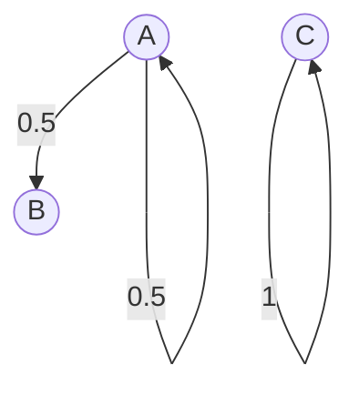

# CHAîNES DE MARKOV ET FILES D'ATTENTE

Utilitaires :

- [Symboles LaTeX](http://detexify.kirelabs.org/classify.html)

- [Fonction supportées par KaTeX](https://katex.org/docs/supported.html#special-notation)

- [Mermaid flowcharts](https://mermaid-js.github.io/mermaid/#/flowchart)

## Chaînes de Markov à temps discret

### Cadre

On se donne $(\Omega, \mathcal{F}, \mathbb{P})$ un espace probabilisé, et $\mathcal{S}$ un enemble **d'états** fini (discret ou dénombrable). 

On note $n \in \mathbb{N}$ le **temps** et on se donne une suite $(X_n)$ de variables aléatoires à valeurs dans $\mathcal{S}$.

#### Définition : Chaîne de Markov

$X_n$ est une **chaîne de Markov à temps discret** si :

$$
\mathbb{P}(X_n = i_n | X_{n-1} = i_{n-1}, \ldots, X_0 = i_0) = \mathbb{P}(X_n = i_n | X_{n-1})
$$

### Matrice de transition d'une chaîne de Markov

On définit la matrice $P^{(n)}$ qui permet de passer de $X_n$ à $X_{n+1}$ telle que : 

$$
p_{i,j}^{(n)} \equiv \mathbb{P}(X_{n+1} = j | X_{n} = i) \\
\scriptsize\forall (i,j) \in \mathcal{S} \times \mathcal{S}
$$

Matriciellement, c'est la probabilité d'aller en `colonne` sachant qu'on est en `ligne`.

#### Définition : Chaîne de Markov homogène

On dit qu'une chaîne de Markov est **homogène** si pour tout $n \in \mathbb{N}$ :

$$
P^{n} = P
$$

C'est-à-dire que la matrice de transition est la même à chaque étape. Dans la suite du cours, on ne considère que des chaînes de Markov (CDM) homogènes.

#### Propriétés élémentaires de la matrice de transition

- Ses coefficients sont toujours positifs ou nuls, et inférieurs à 1.

- C'est une matrice **stochastique** (la somme des éléments d'une ligne vaut 1) :

$$
\sum_{j \in \mathcal{S}} p_{i,j} = 1 \\
\scriptsize\forall i \in \mathcal{S}
$$

- La loi d'un élément de la suite peut s'obtenir avec cette matrice. Soit par exemple $\Phi$ la loi de $X_0$, alors la loi de $X_1$ vaut :

$$
(\mathbb{P}(X_1 = j))_{j \in \mathcal{S}} 
= (\sum_{i \in \mathcal{S}} \mathbb{P}(X_1 = j | X_0 = i)\mathbb{P}(X_0=i))_{j \in \mathcal{S}}
= \Phi P
$$

#### Graphe associé à une chaîne de Markov

Les états (éléments de $\mathcal{S}$ sont les sommets du graphe). On dessine une arrête entre $i$ et $j$ si $p_{i,j} > 0$. Par exemple :

#### Définition : Chemin

Il existe un chemin entre $i$ et $j$ $(i, j) \in \mathcal{S}$ s'il existe un entier $m$ et une suite d'éléments 

$$
i_0=1, i_1, \ldots, i_{m-1}, i_{m} = j
$$

tels que $\forall k \in \llbracket 1,m \rrbracket$

$$
p_{i_k, i_{k+1}} > 0
$$

Autrement dit,

$$
\exist n \in \mathbb{N} / (P^{(n)})_{i,j} > 0
$$

En français : on peut aller de $i$ à $j$ avec une probabilité non nulle.

### Classes d'équivalence

#### Définition : Classe de communication (CdC)

Il y a **équivalence** entre $i$ et $j$ s'il existe un chemin allant de $i$ à $j$ et vice-versa. On note alors $i \sim j$. C'est une relation d'équivalence (réflexive, transitive, symétrique), et on peut donc exhiber une partition de $\mathcal{S}$ entre classes d'équivalence.

On appelle ces classes d'équivalence des **classes de communication**.

#### Définition : Chaîne de Markov irréductible

On dit d'une CDM qu'elle est **irréductible** si elle admet une seule classe d'équivalence.

Autrement dit, on peut toujours trouver un chemin entre tout $i$ et tout $j$ :

$$
\forall (i, j) \in \mathcal{S \times S}, 
\exists m \in \mathbb{N} / P^m_{i,j} > 0
$$

#### Définition : Classe de communication fermée

Une classe de communication $\mathcal{C}$ est dite **fermée** si :

$$
\sum_{j \in \mathcal{C}} p_{i,j} = 1
$$

(On somme sur une partie des éléments d'une ligne)

Autrement dit, lorsqu'on atteint un état de $\mathcal{C}$, on reste toujours dans $\mathcal{C}$.

#### Propriété : Restriction d'une CDM à une CdC fermée

La restriction d'une CDM à une classe de communication fermée est encore une CDM.

#### Définition : Etat absorbant

Un état $i \in \mathcal{S}$ est dit **absorbant** s'il vérifie :

$$
\text{Si } X_0 = i \text{ alors } X_n = i {\text{ pour tout }} n \in \mathbb{N}
$$

### Etats récurrents et transitoires

#### Définition : Temps d'atteinte

On note $T_{i_0}^i$ le **temps d'atteinte** de l'état $i$ en partant de $i_0$ :

$$
T_{i_0}^i = \inf 
\text{\textbraceleft} 
n \in \mathbb{N} / X^n=i | X^0 = i_0
 \text{\textbraceright}
$$

Le temps d'atteinte est une variable aléatoire à valeurs dans $\mathbb{N}^* \cup \text{\textbraceleft} +\infty \text{\textbraceright}$.

Si $i$ et $j$ sont dans la même classe de communication, alors le temps d'atteinte a une probabilité non nulle d'être fini :

$$
\mathbb{P}(T^i_j < + \infty) > 0
$$

#### Définition : Etats récurrents et transitoires

Un état $i$ est dit **récurrent** si le temps d'atteinte de $i$ partant de $i$ est presque sûrement fini :

$$
\mathbb{P}(T^i_i < + \infty) = 1
$$

Sinon, on dit que l'état est **transitoire**.

Un état $i$ est dit **récurrent positif** s'il est récurrent et si de plus :

$$
\mathbb{E}(T_i^i) < + \infty
$$

Sinon, il est dit **récurrent nul**.

#### Théorème : Caractérisation des états récurrents et transitoires

1. Un état $i$ est récurrent si, et seulement si, partant de $i$, on reviendra presque sûrement en $i$ une infinité de fois  :

$$
i \text{ récurrent } 
\iff \mathbb{P}(\#\{ n/X_n=i|X_0=i\} = + \infty) = 1 \\ 
\\ \text{ } \\
\text{i.e.} \sum_n p^n_{i,i} = + \infty

$$

2. On prouve un théorème similaire pour les états transitoires :

$$
i \text{ transitoire } 
\iff \mathbb{P}(\#\{ n/X_n=i|X_0=i\} = + \infty) = 0 \\ 
\\ \text{ } \\ 
\text{i.e.} \sum_n p^n_{i,i} < + \infty
$$

#### Corollaire : Classes de communication récurrentes et transitoires

Au sein d'une classe de communication, les états sont soit tous récurrents, soit tous transitoires. On dira alors de la classe de communication elle-même qu'elle est **récurrente** ou **transitoire**.

#### Proposition : Classes récurrentes et classes fermées

Une classe de communication $\mathcal{C}$ est récurrente <u>ssi</u> elle est fermée.

## Limite d'une chaîne de Markov

On note $\mu_n$ la loi de $X_n$. On a alors $\mu_n = \mu_0 P^n$.

Dans cette section, on s'intéresse à la limite de $\mu_n$ lorsque $n \rightarrow + \infty$.

### Notion de périodicité d'une chaîne de Markov

#### Définition : Chaîne de Markov périodique

Supposons qu'on ait une partition de $\mathcal{S}$ : $E_1, E_2, \ldots , E_K$ telle que :

$$
\forall k \in \llbracket 1,K \rrbracket, 
\forall i \in E_k, \sum_{j \in E_{k+1}}p_{i,j} = 1
$$

Avec la convention $K+1 = 1$ (on écrit les $k$ modulo $K$).

Le plus petit $K$ vérifiant la relation ci-dessus est appelé la **période** de la CDM.

En français : si on est dans un état de $E_k$, on est certain d'être dans un état de $E_{k+1}$ à l'étape suivante. 

Si la partition ne contient que $\mathcal{S}$, alors la chaîne est dite **apériodique**.

### Mesures invariantes

#### Définition : Mesure invariante

Une mesure $\mu$ est dite **invariante** si, pour une matrice de transition $P$ :

$$
\begin{cases}
\mu P = \mu \\
\mu \geq 0
\end{cases}
$$

Si de plus on peut choisir $\mu$ telle que $\sum_{k \in \mathcal{S}} \mu_k=1$, on dit de $\mu$ que c'est une **probabilité invariante**.

<u>Remarque</u> : Les limites éventuelles des lois d'une CDM $(X_n)$ sont de telles mesures. On peut penser à des "vecteurs propres à gauche de P associés à la valeur propre 1".

#### Cas particulier important : chaînes de Markov réversibles

Une chaîne de Markov est dite **réversible** si il existe une mesure $\mu$ telle que :

$$
\forall i,j \in \mathcal{S}, \mu_{i} \times p_{ij} = \mu_{j} \times p_{ji}
$$

On prouve qu'<u>une mesure réversible est invariante</u>.

### Théorèmes limites pour une chaîne de Markov

#### Théorème : Existence d'une mesure invariante

Soit $X_n$ une chaîne de Markov <u>irréductible</u> et <u>récurrente</u>.

Alors, modulo multiplication par $t>0$, il existe une **unique mesure invariante** $\mu$.

#### Théorème ergodique

Soit $X_n$ une chaîne de Markov <u>irréductible</u>. On introduit les notations suivantes :

$$
T^i = \inf \{ n \geq 1 / X_n = i | X_0 = i \}
$$

est le premier temps de retour à $i$ partant de $i$, et

$$
\forall i \in \mathcal{S}, \pi_i = \frac{1}{\mathbb{E}(T^i)}
$$

Avec la convention $\pi_i = 0$ si $i$ est un état transitoire ou réccurent nul.

Alors, on a le résultat de convergence en loi suivant :

$$
\frac{1}{n} \sum_{k=1}^n X_k \xrightarrow \mathcal{L} \pi
$$

En particulier, si $X_n$ est <u>apériodique</u>, 

$$
\mu_i^n = \mathbb{P}(X_n = i) \xrightarrow {n \rightarrow + \infty} \pi_i
$$

avec $\pi_i$ défini comme plus haut, et $\mu$ est l'unique mesure invariante de $X_n$.

## Méthodes de Monte-Carlo fondées sur les chaînes de Markov

### Condition de Doeblin

#### Définition : Condition de Doeblin

Soit $X_n$ une CDM de matrice de transition $P$. La **condition de Doeblin** est vérifiée s'il existe une probabilité $\pi$ et une constante $C > 0$ telles que :

$$
p_{ij} \geq C \pi_j
$$

On peut montrer l'équivalence avec une condition plus faible : 

$$
\exists l \in \mathbb Z / (P^l)_{ij} \geq c \pi_j
$$

#### Théorème : Existence d'une probabilité invariante

Si la CDM $X_n$ vérifie la condition de Doeblin, alors elle admet une unique probabilité invariante.

### Algorithme de Metropolis-Hastings

L'objectif est d'approcher (d'échantilloner selon) une mesure de probabilité inconnue $\pi$ sur un ensemble d'états $\mathcal S$ fini (de cardinal grand).

On suppose connue une mesure invariante $f = \kappa \pi$ où $\kappa$ est un réel inconnu.

Pour l'algorithme, on a besoin de définir une matrice de transition permettant de visiter les différents sites (états). Cette matrice notée $Q$ vérifie :

$$
q_{ij} > 0 \iff q_{ji} >0
$$

En pratique, on choisit $Q$ symétrique.

On définit également une relation d'équivalence : $i$ et $j$ sont dits voisins si $q_{ij} > 0$.

En supposant $f$ donnée, on pose :

$$
\alpha_{ij} = \min \left( 1,\frac{f_j q_{ji}}{f_i q_{ij}} \right)
$$

et on peut alors assembler une matrice stochastique $P$ : 

$$
\begin{cases}
p_{ij} = \alpha_{ij} q_{ij} & \text{si $i$ et $j$ sont voisins} \\
p_{ii} = 1 - \sum_{j \neq i} p_{ij} & \text{sinon}
\end{cases}
$$

#### Propositions : Résultats de convergence

Avec les notations ci-dessus : 

- La CDM $X_n$ associée à $P$ admet $\pi$ comme probabilité invariante.

- Si $Q$ vérifie la condition de Doeblin, alors $P$ vérifie également cette condition.

#### Algorithme : Metropolis-Hastings

L'algorithme est le suivant : 

- On initialise $X_n$ à un état $i$ donné.

- A chaque itération, on choisit aléatoirement un état $j$ candidat pour $X_{n+1}$ à partir de la distribution $q_{ij}$. On tire alors un nombre uniformément aléatoire $v \in [0,1]$ et on calcule le **taux d'acceptation** $\alpha_{ij}$. Alors : 

$$
\begin{cases}
\text{si } v \leq \alpha_{ij} & X_{n+1} = j \\
\text{si } v >    \alpha_{ij} & X_{n+1} = i \\
\end{cases}
$$

Pour $Q$ symétrique, le rapport $\frac{f_j q_{ji}}{f_i q_{ij}}$ devient simplement $\frac{\pi_j}{\pi_i}$.  Le calcul de ce rapport ne nécessite pas nécessairement la connaissance des valeurs des $\pi_i$.

### Algorithme du recuit simulé

On considère un paramètre $\theta$ ("température") qui permet de faire évoluer l'état du système.

L'algorithme consiste à appliquer l'algorithme de Metropolis-Hastings à température constante pendant un certain nombre d'étapes, puis à faire diminuer la température. 

La mesure utilisée est la mesure de Gibbs : 

$$
\mu_{\theta}(j) = \frac{1}{Z_{\theta}} \exp \left(- \frac{\mathcal H(j)}{\theta} \right)
$$

Avec :

- $\mathcal H$ une fonction de $\mathcal S$ (fini) dans $\mathbb R$ appelée **énergie**.

- $Z_{\theta}$ est une constante de normalisation appelée <u>fonction de partition</u>.

On peut prouver qu'on a bien convergence lorsque $n \rightarrow +\infty$ et $\theta \rightarrow 0^+$.

En particulier :

$$
\mu_{\theta} \xrightarrow{\theta \rightarrow 0} \frac{1}{\#\mathcal M}
$$

où $\mathcal M$ est le nombre de minimiseurs de $\mathcal H$.

On utilise 

$$
\theta_n = \frac{\text{cste}}{n}
$$

## Processus de Poisson à temps continu

### Processus de Markov à temps continu

#### Définition : Processus de Markov à temps continu

On considère des temps $t \in \mathbb R$ continus et un ensemble d'états $\mathcal S$ fini ou dénombrable. De façon analogue à ce qu'on a vu précédemment, un processus de Markov à temps continu se définit par : 

$$
\mathbb{P}(X_{t_n} = i_n | X_{t_{n-1}} = i_{n-1}, \ldots, X_{t_0} = i_0) 
= \mathbb{P}(X_{t_n} = i_n | X_{t_{n-1}} = i_{n-1})
$$

Et on ne considèrera que des processus homogènes.

#### Matrice de transition

Soit $\nu^t$ la loi d'un processus de Markov homogène $X_t$ :

$$
\exists P(t) / \nu^t = \nu^0 P(t) \text{ et } \mathbb P(X_t = j | X_0 = i) = P_{ij}(t)
$$

Pour un processus homogène on a la **propriété de semi-groupe** :

$$
\begin{cases}
P(t+s) = P(t)P(s) \\
P(0) = Id
\end{cases}
$$

Si $\mathcal S$ est fini, on peut prouver qu'il existe une matrice $A$ telle que :

$$
P(t) = e^{tA}
$$

Où on emploie l'exponentielle de matrice :

$$
e^{tA} = \sum_{n=0}^\infty \frac{t^n A^n}{n!}
$$

On appelle $A$ le **générateur infinitésimal** du processus $X_t$ et on le définit comme :

$$
A = \lim_{t \rightarrow 0^+} \frac{P(t) - Id}{t}
$$

### Comportement asymptotique des processus de Markov

#### Lemme : probabilité invariante et générateur infinitésimal

Une probabilité $\pi$ est dite **invariante** pour $X^t$ si :

$$
\pi = \pi P(t) \iff \pi A = 0
$$

L'équivalence ci-dessus peut être prouvée.

#### Définition : irréductibilité

Un PDM est dit **irréductible** si :

$$
\forall t > 0, P_{ij}(t) > 0
$$

#### Théorème ergodique

Soit $X^t$ un PDM <u>irréductible</u>. On a les résultats de convergence suivants :

- Une convergence "en moyenne" :

$$
\frac{1}{t} \int_0^t \chi_{\{ X_t = i \}} ds \rightarrow \pi_i
$$

- Si il existe une unique probabilité invariante $\pi$, alors on a deux cas :
  
  - Si le PDM est récurent positif :
    
    $$
    P(X_t = i) \rightarrow \pi_i
    $$
  
  - Si le PDM est récurrent nul ou transitoire : 
    
    $$
    P(X_t = i) \rightarrow 0
    $$
  
  On définira par la suite les états récurrents et transitoires.

### Processus de Poisson à temps continu

#### Définition : Processus de Poisson

On considère que l'ensemble d'états est $\mathbb N$. On définit $(T_k)$ une suite de temps aléatoires i.i.d. suivant une <u>loi exponentielle</u> de paramètre $\lambda > 0$.

On définit alors $S_n$ comme la somme des $T_k$ jusqu'à $n$.

Un **processus de Poisson à temps continu** se définit comme :

$$
N_t = \sum_{n=1}^\infty \chi_{ \{ S_n \in [0,t] \} } 
= \# \{ n / S_n \leq t \}
$$

En français : on reste sur une marche pendant un temps aléatoire $T_k$, au bout duquel on monte d'une marche, et on recommence. La variable $N_t$ compte le nombres de marches gravies en un temps $t$.

#### Théorème : Propriétés sur les processus de Poisson

- $N_t$ est suit une loi de Poisson de paramètre $\lambda t$.

- Les incréments du processus sont indépendants : pour toute suite croissante $t_j$, les variables aléatoires $N_{t_{j+1}} - N_{t_{j}}$ sont indépendantes.

- Les incréments sont stationnaires : $N_{t+s} - N_s \sim_{\mathcal L} N_t$.

#### Définition : Chaîne de Markov induite associée au processus de Poisson

On note $Y_n$ la chaîne de Markov qui donne l'endroit où l'on est après "$n$ montées de marche". 

De façon générale, pour tout processus en temps continu on peut associer une **chaîne de Markov induite** $Y_n$.

On notera $Q$ la matrice de transition de $Y_n$, qui contient les probabilités d'aller d'état en état. Par exemple, pour un processus de Poisson, on a juste :

$$
q_{ii+1} = 1
$$

puisqu'on ne peut que "monter les marches".

#### Définition : Processus récurrent ou transitoire

Soit $Y_n$ la chaîne induite d'un processus <u>irréductible</u> $X_t$. On dit alors que :

- $X_t$ est **récurrent** si $Y_n$ est récurrente.

- X_t est **transitoire** si $Y_n$ est transitoire.

#### Proposition : Lien entre $Q$ et $A$ pour un processus de Poisson

On a les relations suivantes :

$$
\forall i \neq j
\begin{cases}
a_{ij} = \lambda_i q_{ij} \\
a_{ii} = - \sum_{i \neq j} a_{ij}
\end{cases}
$$

avec $\lambda_i$ le temps moyen d'attente en $i$.

#### Proposition : Loi suivie par le temps de "repos" en un site

On considère un processus à saut général. On place sur chaque site $j$ un "réveil" dont le temps de sonnerie suit une loi exponentielle de paramètre $\lambda_j$.

Alors : 

$$
\mathbb P(t < \min_j T_j) 
= e^{-(\lambda_1 + \lambda_2 + \ldots + \lambda_i)t}
$$

### Processus de vie et de mort

#### Définition : Processus de vie et de mort

On considère qu'on a $i$ individus vivants à un instant $t$. A chaque instant on peut avoir une mort ou une naissance. On suppose que les temps de naissance et de mort suivent respectivement des lois exponentielles de paramètre $\beta_i$ et $\delta_i$.

Son générateur infinitésimal $A$ est tel que :

$$
\begin{cases}
a_{ii} = -\beta_i - \delta_i \\
a_{ii+1} = \beta_i \\
a_{ii-1} = \delta_i \\
a_{ij} = 0 & \text{sinon}
\end{cases}
$$

## Notion de file d'attente

### Notation de Kendall

On modélise une file d'attente par la notation :

$$
A / B / C / K
$$

Avec : 

- $A$ la variable aléatoire donnant le temps d'arrivée d'un client.

- $B$ la variable aléatoire donnant le temps d'exécution du travail (ou temps de service).

- $C$ le nombre de serveurs.

- $K$ la taille globale de la salle d'attente. Dans la suite, on prendra $K = \infty$.

Lorsque $A$ et $B$ suivent des lois exponentielles, on retrouve un processus de vie (arrivée d'un client) et de mort (sortie d'un client).
